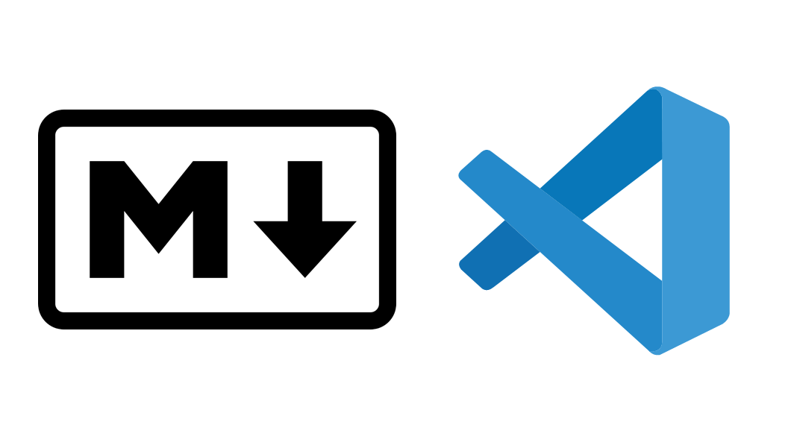

## Description

Hi all,

Visual Studio Code has become one of the top IDEs, but did you know you can use it for simple documentation? You only need to learn some Markdown basics!

In this meetup, I explained some basic for that:

1. Markdown, when to use it? When not to use it?
2. VS Code, out of the box features
3. VS Code extensions for Markdown
4. VS Code snippets: How to increase your productivity with templates

The content is ideal for quick instructions/step by step guides.

## Video and Slides

* [Meetup recording](https://www.dropbox.com/s/ktcrtvg56j6ddhk/visualstudiocodefordocumentation%20on%202020-05-22%2016%3A17.mp4?dl=0)
* [Presentation](https://github.com/cangulo/meetups/raw/master/vs_code_for_docs/2020_05_22_write_bcn/vs_code_for_docs_20200522.pptx)
* [Code](https://github.com/cangulo/meetups/tree/master/vs_code_for_docs/2020_05_22_write_bcn)
* [Meetup Event](https://www.meetup.com/Write-the-Docs-Barcelona/events/270480043/)