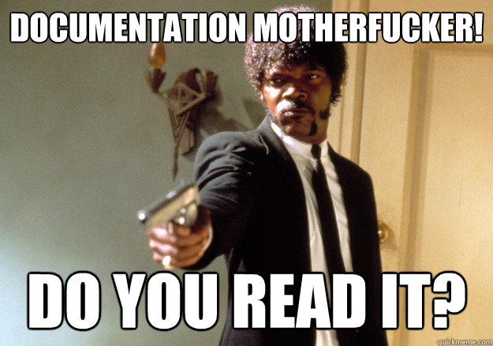

<!-- HERE: Example for normal text -->
This is a simple line 

<!-- HERE: Example for Bold -->
**This is bold text**

<!-- HERE: Example for Italic  -->
*This italic*


<!-- HERE: Example for Links -->
[This is a link](www.google.es)


<!-- HERE: Example for Images -->


<!-- HERE: Example for Headers -->
# Header 1
## Header 2
...
###### Header 6

<!-- HERE: Example for Inline code -->
`x=2;`
```
x=2;
```

<!-- HERE: Example for Quote -->
> This is a quote

<!-- HERE: Example for Lists -->
* Item 1
* Item 2
* Item 3

<!-- HERE: Example for Tables -->
header 1 | header 2
-|-
item 1 | item 2
